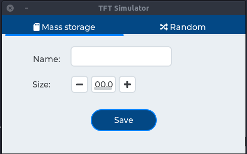
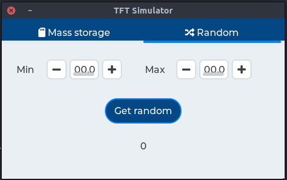

# Embedded graphical interface for TRNG (True Random Number Generator)
This project implements an embedded graphical interface for generate true random numbers.

# Introduction
The idea behind this project is allow user to generate true random numbers (*TRNG* not *PRNG*) from a simple graphical interface. User can just generate a single number in a given range (0 - 100 for example) or save an amount of bytes into a file system (SD card needed).

This project uses a microcontroller plataform (`STM32`) to implement a true random number generator.
Development was done using `STM32F746g-Discovery` board from STMicroelectronics

# Graphical interface
The first screen contains some widgets for give a file name, a file size and save into file system an amount of random bytes.

The second one screen contains two spinboxes to define a range to generate a single random number .

# Dependencies

## Software
To build this project you need:
- A PC `host` runing `GNU/Linux`
- Toolchain [arm-none-gnueabi-gcc](https://developer.arm.com/tools-and-software/open-source-software/developer-tools/gnu-toolchain/gnu-rm/downloads) for `arm cortex M` microcontrollers
- `Make` tool to use `Makefile`
- Library [LVGL](https://github.com/lvgl/lvgl) (up to `7.0`)
- [OpenOCD](http://openocd.org/) tool for build/debug firmware
- [STM32CubeMX](https://www.st.com/en/development-tools/stm32cubemx.html) to change peripheral

## Hardware
To run this project you need
- Devboard [STM32F746g-Discovery](https://www.st.com/en/evaluation-tools/32f746gdiscovery.html)

